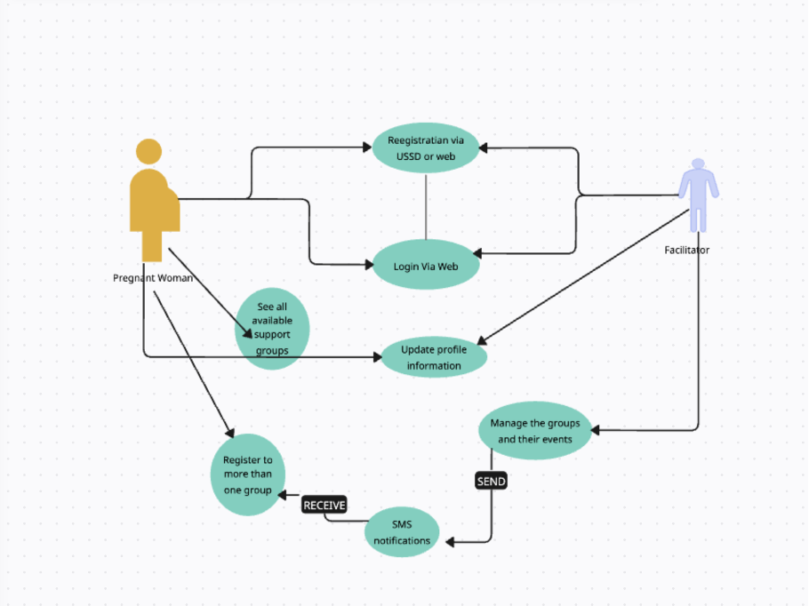

# EmpowerHer
EmpowerHer-frontend is a react website that groups together support groups that are registered to the website, and facilitates the registration process for adolescent mothers and their participation in different activities that are arranged by the support group. 

### Github Repo
https://github.com/CynthiaUmuhire/EmpowerHer-frontend

### Backend repo
https://github.com/CynthiaUmuhire/EmpowerHer-Backend.git

## How to set up the project
1. Clone the github repo provided above
2. Create e `.env` file and paste the contents of the `.env.example` file.
3. run `pnpm install`
4. run `pnpm dev`
5. Then open the link that will be provided in the terminal where in most cases it will be 
 http://localhost:5173/

## Figma designs

## Use case diagram

## Deployment plan 
1. CI/CD: GitHub Actions for automated builds and code quality checks.
2.	Version control: GitHub for tracking code changes.
3.	Hosting: Vercel for a fast and reliable deployment.
